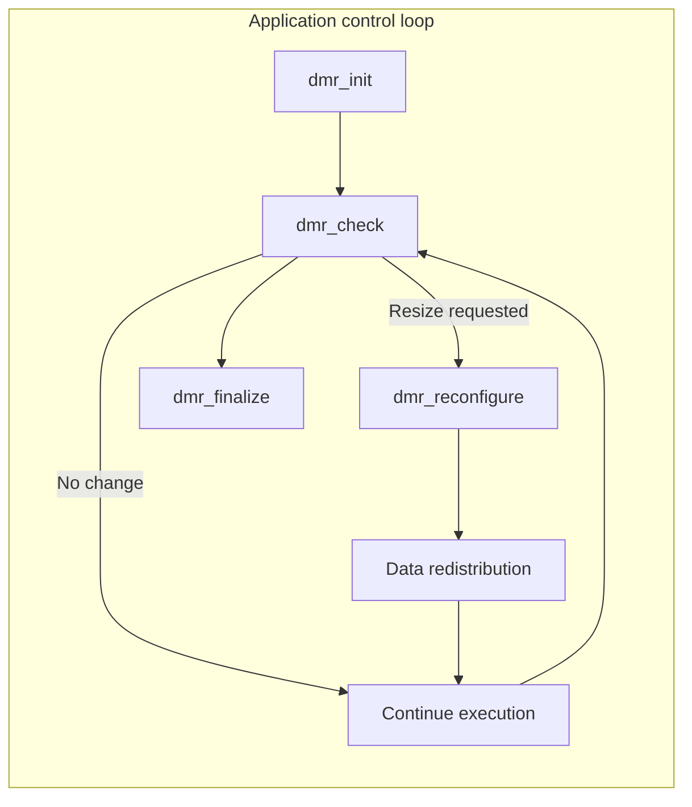

import Admonition from '@theme/Admonition';

<figure className="text--center">
  
</figure>

# What is DMR?

DMR, short for Dynamic Management of Resources and pronounced "dimmer", is a framework for MPI-based applications that allows running jobs to **change their resource allocation during execution** instead of staying fixed from start to finish. It enables applications to grow and shrink while they run, helping HPC workloads adapt to changing computational needs and system conditions.

<Admonition type="info" title="In one sentence">
DMR is an MPI malleability framework that helps HPC applications adapt their resources at runtime by coordinating reconfiguration across the application, MPI runtime, and resource manager.
</Admonition>

<figure className="text--center">
  
  <figcaption>
    *An electric current dimmer for power control, like DMR dynamically managing resources.*
  </figcaption>
</figure>

DMR is developed and maintained by the [Barcelona Supercomputing Center](https://www.bsc.es/) and it is distributed under the **GNU General Public License, Version 2 (GPLv2)**.

## Why DMR exists

Most production HPC systems still rely on static resource allocation: a job starts with a fixed number of nodes and keeps them until it finishes. This works for predictable workloads, but many real applications change behavior over time, which means a fixed allocation can waste resources or slow execution.

DMR addresses this mismatch by enabling dynamic resource management for MPI applications. Instead of forcing the application to use the same amount of hardware for every phase, DMR allows it to request more resources, release some of them, or continue unchanged depending on what is happening during execution. 

## What DMR enables

With DMR, an application can:

- Expand when additional resources become useful.
- Shrink when fewer resources are enough.
- Reconfigure its MPI process layout during runtime.
- Redistribute data after a resize, either in memory or through checkpoint/restart mechanisms.
- Coordinate these changes with the MPI runtime and the resource manager instead of handling them manually inside the application.

A simple example is an MPI job that starts small, grows during a communication-efficient phase or the cluster has too many idle resources, and later shrinks again when the workload becomes lighter or the cluster gets saturated. The DMR describes this as a feedback-driven workflow built around initialization, periodic checks, and reconfiguration. 

## Runtime workflow

At a high level, DMR sits between four layers: the scientific application, the MPI runtime and process manager, performance or execution monitors, and the resource management system such as Slurm. Through this position, DMR helps the application query resource availability, request reconfigurations, and adapt its execution footprint dynamically.

<figure className="text--center">
  
  <figcaption>
    *DMR design and working modes.*
  </figcaption>
</figure>

The application periodically asks DMR whether a reconfiguration should happen. If the answer is yes, DMR coordinates the required changes across the software stack and then resumes execution with the updated process and resource layout.

## Core API idea

In practice, DMR is commonly presented through four core operations: `dmr_init` initializes the dynamic environment, `dmr_check` evaluates whether a reconfiguration should occur, `dmr_reconfigure` performs the transition, and `dmr_finalize` releases internal state and shuts the framework down cleanly.

<figure className="text--center">

</figure>

<Admonition type="tip" title="Mental model">
Think of DMR as a control layer for MPI malleability: the application decides where adaptation is safe, and DMR coordinates how that adaptation happens across jobs, processes, data, and resources.
</Admonition>

## Why it matters in production HPC

Dynamic resource management has been studied for years, but many approaches depend on custom scheduler modifications or controlled testbed environments. DMR is designed to support production-oriented HPC settings and unmodified Slurm deployments, which lowers the barrier to adopting MPI malleability on real systems.

This matters because production clusters are shared, busy, and heterogeneous. In that setting, DMR can help applications use resources more efficiently, reduce wasted node-hours, and adapt to runtime conditions without requiring users or administrators to redesign the entire platform.

## Who should read this

This page is for:

- HPC developers working with MPI applications. 
- Researchers exploring malleability and dynamic resource management.
- Teams that want to move from fixed-size batch execution toward adaptive execution models.
- Application developers who need a practical path from controlled experiments to production deployments.

It is especially relevant when an application has phases with different computational intensity, communication behavior, or hardware needs.

## Where to go next

- Continue to the [installation guide](../getting-started/installation) to set up DMR in your environment.
- Open the [example codes](../examples/hello-world) to see how DMR is used.
- Read the [user guide](../user-guide/app-structure) to understand application structure and data redistribution.
- Use the [API reference](../api/core-api) when integrating DMR into your own code.

