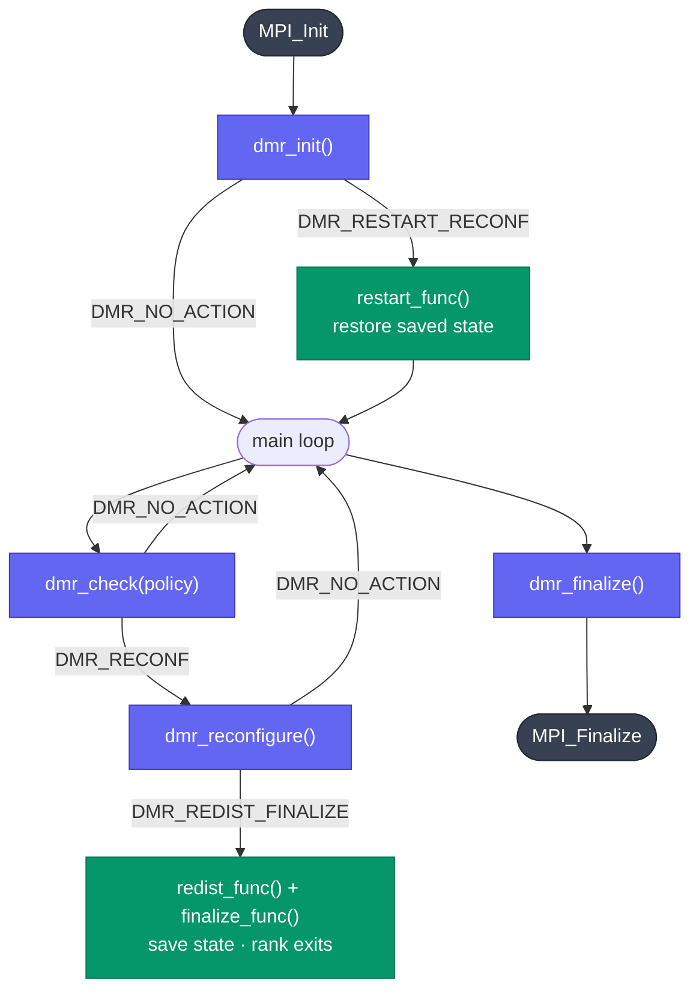

A DMR application is built around three lifecycle functions and a main loop. The central concept is that DMR returns a `DMRAction` value telling you what to do next, and `DMR_AUTO` handles the dispatch automatically.

## How reconfigurations work

This is the most important thing to understand before writing a DMR application.

When a reconfiguration happens, the current processes exit and the **wrapper relaunches the executable from the beginning** with the new process count. This means `main()` is called again from scratch, all local variables are reset.

If your application has a loop that tracks progress with a local variable, that variable will always be zero on restart:

```c
// WRONG: infinite loop
int main(int argc, char *argv[]) {

    // <-- after every reconfiguration, execution restarts here
    MPI_Init(&argc, &argv);
    DMR_AUTO(dmr_init(argc, argv), (void)NULL, (void)NULL, (void)NULL);

    for (int i = 0; i < 10; i++) {  // i is always 0 on restart
        DMR_AUTO(dmr_check(SHOULD_EXPAND), save(), (void)NULL, (void)NULL);
        do_work(i);
    }
    // never reached
}
```

You must **persist any state that needs to survive a reconfiguration** to disk, and restore it in `restart_func`:

```c
// CORRECT: save i before leaving, restore it on restart
typedef struct { int i; } AppState;

void save_state(void) {
    AppState s = { .i = current_i };
    FILE *f = fopen("checkpoint.bin", "wb");
    fwrite(&s, sizeof(s), 1, f);
    fclose(f);
}

void load_state(void) {
    AppState s;
    FILE *f = fopen("checkpoint.bin", "rb");
    fread(&s, sizeof(s), 1, f);
    fclose(f);
    current_i = s.i;
}

int current_i = 0;

int main(int argc, char *argv[]) {
    MPI_Init(&argc, &argv);
    DMR_AUTO(dmr_init(argc, argv), (void)NULL, load_state(), (void)NULL);

    while (current_i < 10) {
        DMR_AUTO(dmr_check(SHOULD_EXPAND), save_state(), (void)NULL, (void)NULL);
        do_work(current_i);
        current_i++;
    }
    ...
}
```

The loop condition uses `current_i` (a global that survives via checkpoint), not a local `i`. After restart, `load_state()` restores it to where the previous run left off.

## Lifecycle overview



- **Purple**: DMR library calls
- **Green**: callbacks you implement
- **Dark**: MPI

## Typical main loop

```c
#include <mpi.h>
#include "dmr.h"

static void save_checkpoint(void)  { /* persist state on disk */ }
static void load_checkpoint(void)  { /* read data written by previous configuration */ }
static void cleanup(void)          { /* free resources */ }

int main(int argc, char *argv[])
{
    MPI_Init(&argc, &argv);

    /* dmr_init may return DMR_RESTART_RECONF if this process was spawned
       as part of an expansion; load_checkpoint() handles that case. */
    DMR_AUTO(dmr_init(argc, argv), (void)NULL, load_checkpoint(), cleanup());

    dmr_set_policy_min_nodes(2);
    dmr_set_policy_max_nodes(8);

    while (should_keep_running()) {
        DMR_AUTO(dmr_check(ROUND_POLICY), save_checkpoint(), (void)NULL, cleanup());
        do_work();
    }

    DMR_AUTO(dmr_finalize(), (void)NULL, (void)NULL, cleanup());
    MPI_Finalize();
    return 0;
}
```

## dmr_init

Call `dmr_init` immediately after `MPI_Init`. **Collective.**

Returns `DMR_NO_ACTION` on first launch, or `DMR_RESTART_RECONF` when the executable has been restarted after a reconfiguration (see [How reconfigurations work](#how-reconfigurations-work) above). `DMR_AUTO` invokes `restart_func` in the second case.

## dmr_check

Call `dmr_check` inside the main loop with a `DMRSuggestion`. **Collective.**

When DMR decides to reconfigure it returns `DMR_RECONF`. `DMR_AUTO` then calls `dmr_reconfigure()` internally, which handles the MPI communicator setup. The leaving processes receive `DMR_REDIST_FINALIZE` from `dmr_reconfigure()` ; `DMR_AUTO` calls `redist_func` and `finalize_func` on them and terminates those ranks.

## dmr_reconfigure

Called automatically by `DMR_AUTO` when `DMR_RECONF` is returned. Do not call it manually unless you handle `DMRAction` values yourself.

## dmr_finalize

Call `dmr_finalize` before `MPI_Finalize`. It is not collective, but once a rank calls it no further DMR calls can be made from that rank.

## Communicator and checkpoint-restart

DMR supports two redistribution strategies, selected at compile time:

| Strategy | `DMR_CHECKPOINT_RESTART` | How it works |
|----------|--------------------------|--------------|
| **Checkpoint-restart** (default) | `1` | Old processes save state to disk and exit; new processes start from the beginning of the executable and restore state via `restart_func` |
| **Intercommunicator** | `0` | Old and new processes are alive simultaneously; they exchange data directly via `DMR_INTERCOMM`, then the old ones exit. New processes also start from the beginning of the executable. |

See [Data Redistribution](data-redistribution) for a detailed explanation of the `DMR_CHECKPOINT_RESTART=0` workflow.

## Who owns `MPI_Init` and `MPI_Finalize`

The skeletons above have the application call `MPI_Init` and `MPI_Finalize` directly. In real codes another library (e.g. a simulator or solver) often initializes and finalizes MPI itself. Two rules keep this working with DMR:

- **`MPI_Init` must run before `dmr_init`.** DMR uses MPI from `dmr_init` onward (`dmr_init` calls `MPI_Comm_get_parent` to detect a spawned process). Whoever owns MPI must initialize it first. If a library initializes MPI, call its init *before* `dmr_init`; do not call `MPI_Init` twice.
- **On a reconfiguration, DMR finalizes MPI for you on the leaving ranks.** When `dmr_finalize()` runs as part of a reconfiguration it calls `MPI_Finalize()` and then `exit()` — the executable is being torn down so a fresh world can take over. Your post-loop `MPI_Finalize()` is reached **only** on a normal, non-reconfiguring exit.

The practical hazard is a **double `MPI_Finalize`**: if a library's teardown calls `MPI_Finalize` and you run that teardown in `finalize_func` (or after the loop) on a leaving rank, it collides with the `MPI_Finalize` inside `dmr_finalize()`. On leaving ranks, release the library's MPI-bound state without finalizing MPI, and let `dmr_finalize()` own the actual `MPI_Finalize`. See the warning in [Reconfiguration Handling](reconfiguration-handling#finalize_func-clean-up-resources).

## Thread safety

DMR is **not thread-safe**. Do not call any DMR function from multiple threads concurrently.
